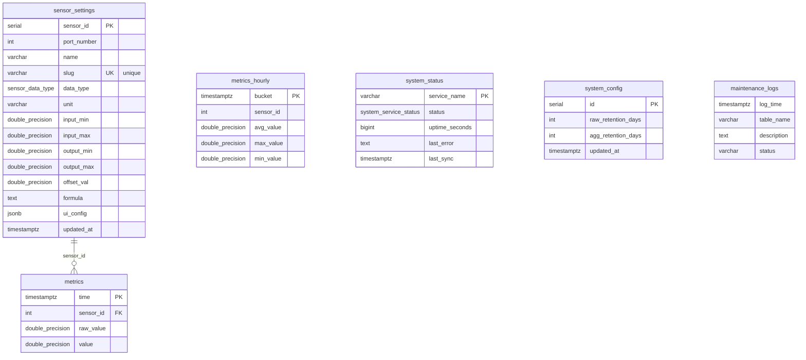

```mermaid
erDiagram
    sensor_settings ||--o{ metrics : "sensor_id"

    sensor_settings {
        serial sensor_id PK
        int port_number
        varchar name
        varchar slug UK "unique"
        sensor_data_type data_type
        varchar unit
        double_precision input_min
        double_precision input_max
        double_precision output_min
        double_precision output_max
        double_precision offset_val
        text formula
        jsonb ui_config
        timestamptz updated_at
    }

    metrics {
        timestamptz time PK
        int sensor_id FK
        double_precision raw_value
        double_precision value
    }

    metrics_hourly {
        timestamptz bucket PK
        int sensor_id
        double_precision avg_value
        double_precision max_value
        double_precision min_value
    }

    system_status {
        varchar service_name PK
        system_service_status status
        bigint uptime_seconds
        text last_error
        timestamptz last_sync
    }

    system_config {
        serial id PK
        int raw_retention_days
        int agg_retention_days
        timestamptz updated_at
    }

    maintenance_logs {
        timestamptz log_time
        varchar table_name
        text description
        varchar status
    }
```